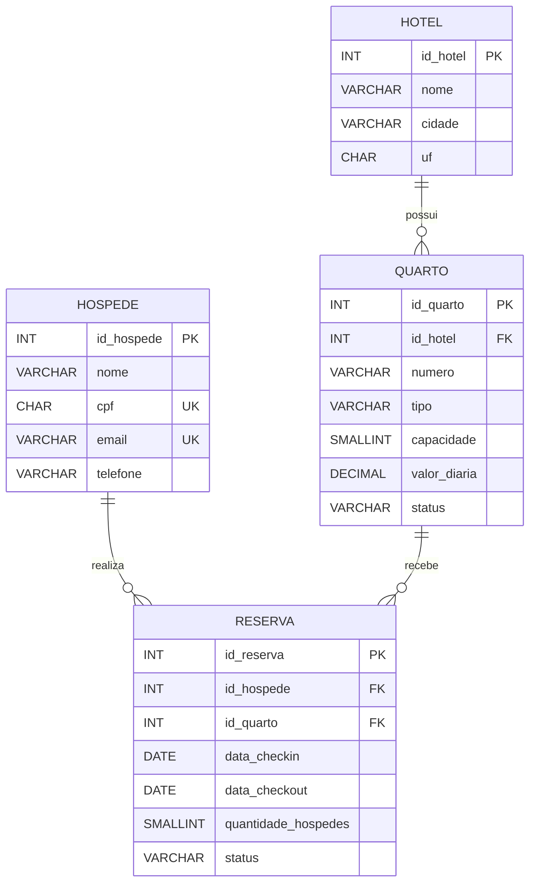

# Modelo Lógico — Rede de Hotéis

## Relações e regras

- Um **hotel** possui zero ou muitos quartos; cada quarto pertence a exatamente um hotel.
- Um **hóspede** realiza zero ou muitas reservas; cada reserva pertence a exatamente um hóspede.
- Um **quarto** pode constar em zero ou muitas reservas ao longo do tempo; cada reserva é para exatamente um quarto.
- O número do quarto é único dentro do hotel (`id_hotel`, `numero`).
